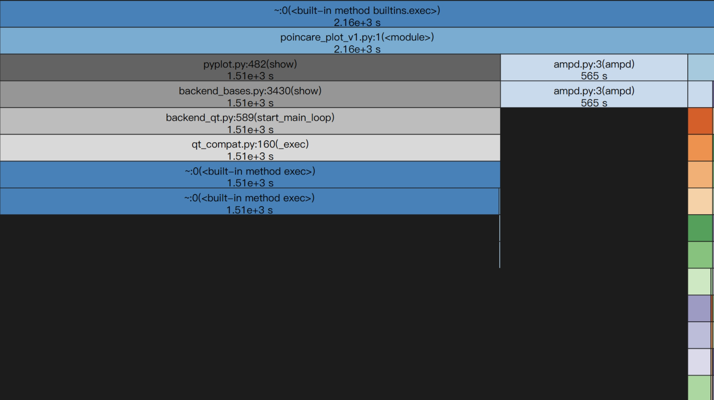

# 心路历程

有肖博提供的手动[AMPD算法](https://zhuanlan.zhihu.com/p/549588865)、SciPy的[find_peaks](https://docs.scipy.org/doc/scipy/reference/generated/scipy.signal.find_peaks.html)、NeuroKit2的[ecg_peaks](https://neuropsychology.github.io/NeuroKit/functions/ecg.html)。

手动算法是非常棒的，SciPy的寻峰算法就是屎，NeuroKit2更是一坨狗屎。
还得靠手写算法，什么调包都是纯纯扯淡！

最终把两个函数结合起来，成功地实现了庞加莱散点图的绘制。但是这个算法循环过多，运算时间消耗极其恐怖，是我所不能忍受的！

用广播操作替代掉原版程序中狗屎一般的for循环，将程序性能提升90倍。

